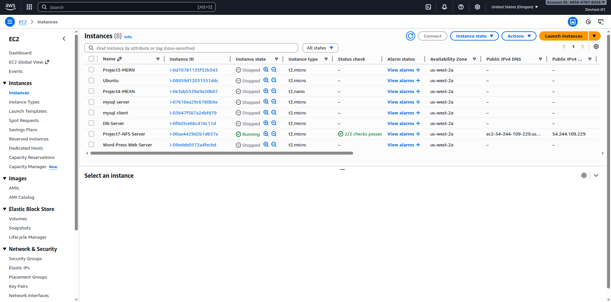
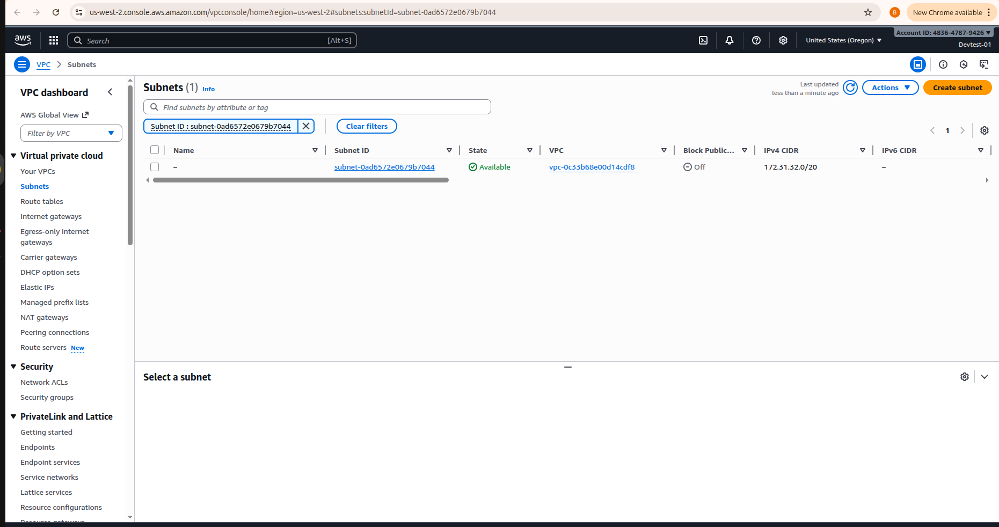
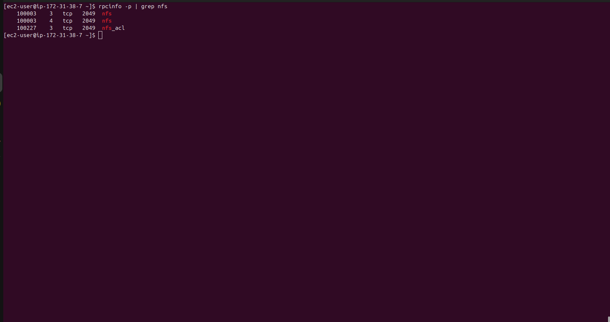

## Devops Tooling Website Solution for 3 -Tier Architecture
AS a DevOps engineer there are tools that must have.In this project we are going to setup a website and build it using the DevOps tools such as 
- Jenkins
- Kubernetes
- Rancher
- Grafana
### Prerequisite

Infarastructure: AWS
Webserver Linux: RedHat Enterprise linux 9
Database Server: ubuntu 24.04  + MySql
Storage Server: RedHat Linux Enterpriser 9
Programing Language: PHP
Code Repository: Github

### Step 1. Setting up NFS Server
Navigate to AWS dashboard and choose a new EC2 Instance
choosing RHEL Linux 9 OS.
Launch the instance and when ready ssh into it.

### Step 2. Configuring LVM on the server
create 3 volumes of 10Gb each and attach to ec2 instance.

Partitioning the disks

Instaslling lvm 

```sh
    sudo yum install lvm2
```

Creating volume groups using pvcreate 


Creating 3 logical volumes. lv-opt, lv-apps and lv-logs
formating the disks as xfs


Create mount points on /mnt directory for logical volumes.

Verifying mounting

### Step 3. Installing NFS Server
Installing NFS Server on Storage server
```sh
     sudo yum -y update
     sudo yum install nfs-utils -y
     sudo systemctl start nfs-server.service
     sudo systemctl enable nfs-server.service
     sudo systemctl status nfs-server.service
```


### Step 4. Exporting the mount for Webservers Subnet cidr to connect as clients.

getting the subnet from ec2 instance networking tabs and updating the exports files with the subnet cidr


### Step 5. Configuring Security Groups
Checking which port is used by NFS and allowing access by updating inbound rules with the shown ports
```sh
    rpcinfo -p | grep nfs
```

Updating Inbound rules
